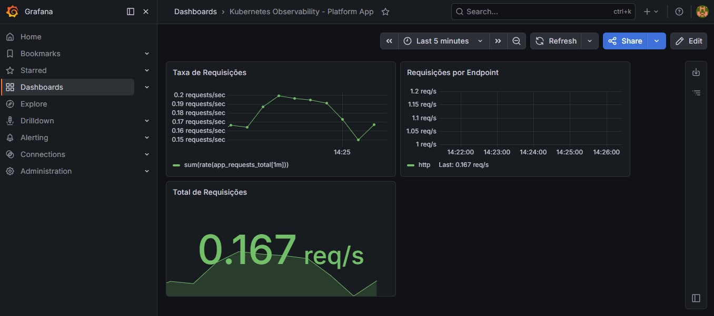

# 🚀 Kubernetes Observability Platform

Projeto completo de observabilidade utilizando Kubernetes, Prometheus, Grafana e Alertmanager, com deploy estruturado via Kustomize.

---
## 🧪 Projeto 100% funcional

Este projeto foi testado localmente com Minikube e demonstra:

- Coleta de métricas com Prometheus
- Visualização com Grafana
- Alertas com Alertmanager (envio real por email)

---
## 📌 Visão Geral

Este projeto demonstra a construção de um pipeline completo de monitoramento e alerta para uma aplicação Python em ambiente Kubernetes, seguindo boas práticas utilizadas em ambientes reais de produção.

---

## 🧱 Arquitetura

```
User → Application (Flask)
↓
Prometheus (scraping /metrics)
↓
Grafana (visualização)
↓
Alertmanager (alertas por email)
```

---

## ⚙️ Tecnologias Utilizadas

* Python (Flask)
* Prometheus Client
* Kubernetes
* Kustomize
* Prometheus Operator (kube-prometheus-stack)
* Grafana
* Alertmanager
* Docker

---

## 📦 Estrutura do Projeto

```
k8s-platform-observability/
│
├── app/
│   ├── app.py
│   ├── requirements.txt
│   └── Dockerfile
│
├── k8s/
│   ├── alertmanager-config.yaml
│   ├── base/
│   │   ├── app-deployment.yaml
│   │   ├── app-service.yaml
│   │   ├── namespace.yaml
│   │   ├── service-monitor.yaml
│   │   ├── prometheus-rule.yaml
│   │   └── kustomization.yaml
│   │
│   └── overlays/
│       └── dev/
│           └── kustomization.yaml
│
├── docs/
│   └── architecture.md
│
└── README.md
```

---

## 📊 Métricas Coletadas

* `app_requests_total`
* `process_cpu_seconds_total`
* `process_resident_memory_bytes`

---

## 📈 Dashboard (Grafana)

### Taxa de Requisições

```promql
sum(rate(app_requests_total[1m]))
```

### Total de Requisições

```promql
sum(app_requests_total)
```

### Requisições por Endpoint

```promql
sum by (endpoint) (rate(app_requests_total[1m]))
```

---

## 🚨 Alertas Configurados

### 🔸 NoRequests

Dispara quando não há requisições:

```promql
sum(rate(app_requests_total[2m])) == 0
```

---

### 🔸 HighRequestRate

Dispara quando há alta carga:

```promql
sum(rate(app_requests_total[1m])) > 5
```

---

## 🔔 Notificações

* Email via Alertmanager (SMTP Gmail)

---

## 🛠️ Deploy com Kustomize

### Aplicar toda a infraestrutura

```bash
kubectl apply -k k8s/overlays/dev
```

---

## ▶️ Acessos locais

### Aplicação

```bash
kubectl port-forward svc/platform-service -n platform-dev 8080:80
```

---

### Prometheus

```bash
kubectl port-forward svc/monitoring-kube-prometheus-prometheus -n monitoring 9090:9090
```

---

### Grafana

```bash
kubectl port-forward svc/monitoring-grafana -n monitoring 3000:80
```

---

### Alertmanager

```bash
kubectl port-forward svc/monitoring-kube-prometheus-alertmanager -n monitoring 9093:9093
```

---

## 🧪 Testes

### Gerar carga

```bash
for i in {1..200}; do curl http://localhost:8080/; done
```

---

## 🎯 Objetivo

Demonstrar conhecimento prático em:

* Observabilidade
* Monitoramento
* Alertas
* Kubernetes
* Kustomize
* DevOps / SRE

---

## 📸 Evidências

### Prometheus Targets


### Prometheus Query


### Prometheus Alerts


### Grafana Dashboard


### Kubernetes Pods


### Services & Endpoints


---

## 👨‍💻 Autor

Daniel Viana

