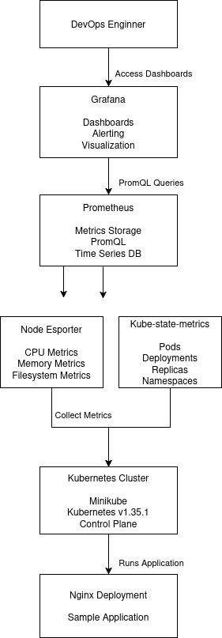
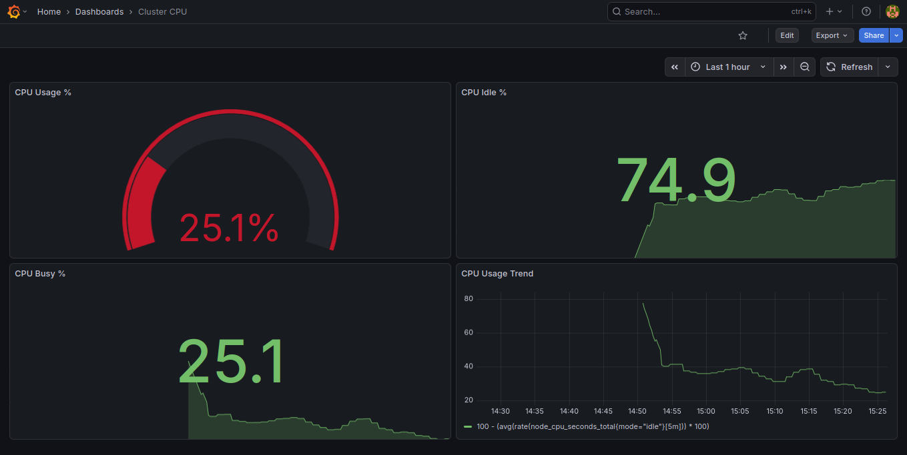
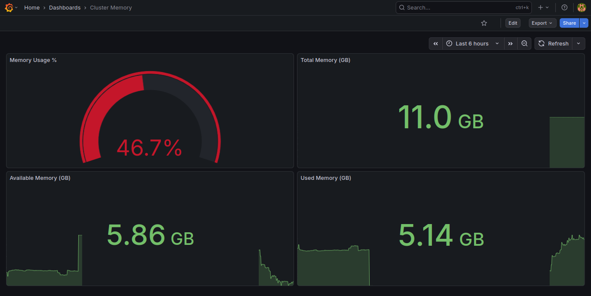
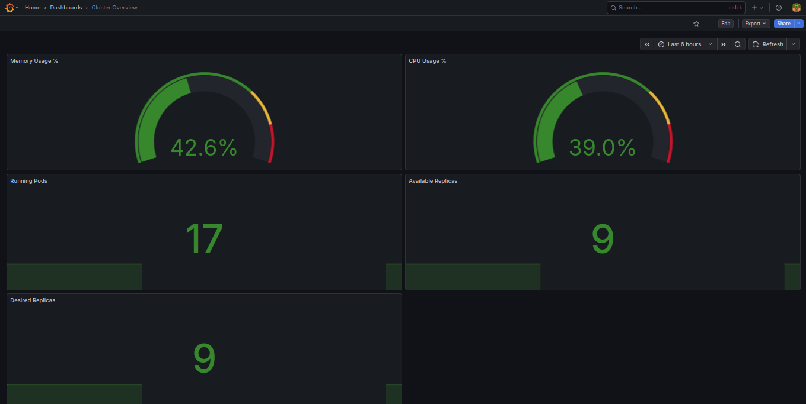
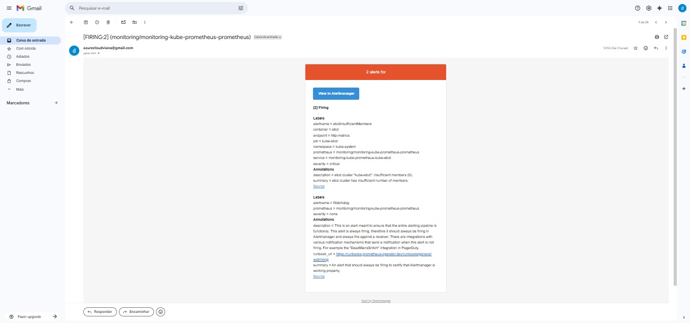
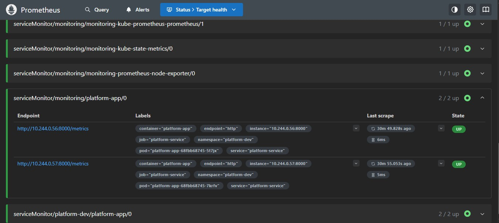
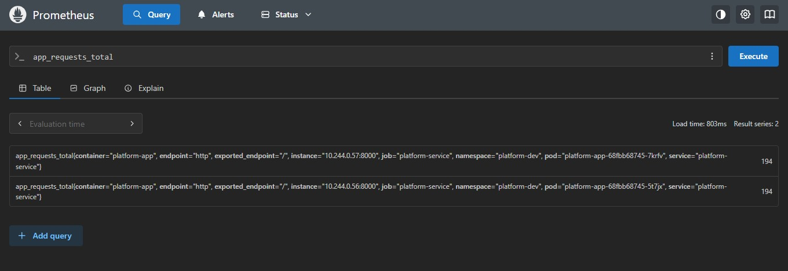
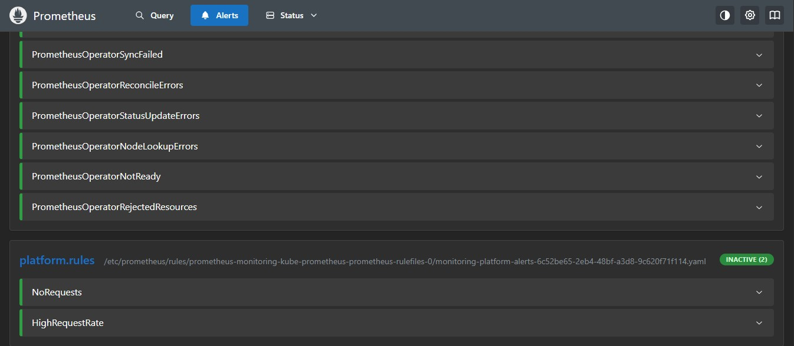
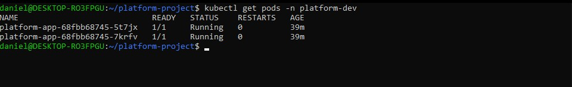
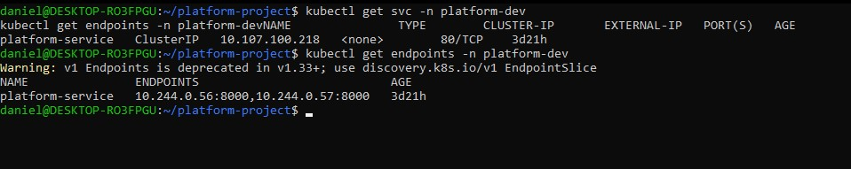

# 🚀 Kubernetes Observability Platform

## 🧠 Problem Statement

Modern distributed systems running on Kubernetes require robust observability to ensure reliability, performance and rapid incident response.

Without proper monitoring, failures such as pod crashes, resource exhaustion or deployment misconfigurations can go undetected, leading to downtime and degraded user experience.

This project simulates a real-world observability stack that demonstrates how Kubernetes workloads can be monitored, visualized and managed through metrics-driven operations.

---

## 🎯 Objective

Build an end-to-end observability platform capable of:

* Collecting metrics from Kubernetes workloads and nodes
* Visualizing system health through dashboards
* Defining and triggering alert rules
* Simulating production-like incidents
* Demonstrating incident detection and recovery workflows

---

## 🏗️ Architecture Overview



### System Flow

```text
Application (Flask / Workloads)
        ↓
Kubernetes Metrics Layer
        ↓
Prometheus (Metrics Collection & Evaluation)
        ↓
Grafana (Dashboards & Visualization)
        ↓
Alertmanager (Alert Routing)
        ↓
Email Notification (Incident Response)
```

---

## 🧩 Core Components

* Kubernetes (Minikube)
* Prometheus
* Grafana
* Alertmanager
* Node Exporter
* kube-state-metrics
* Flask Application (custom metrics source)

---

## 📊 Dashboards

### Cluster Overview

* CPU Usage
* Memory Usage
* Pod Status
* Replica Health


---

### Cluster CPU

* CPU Usage %
* CPU Idle %
* CPU Busy %



---

### Cluster Memory

* Memory Usage %
* Total Memory
* Available Memory
* Used Memory



---

### Cluster Availability

* Running Pods
* Failed Pods
* Pending Pods
* Available Replicas



---

## 📈 Key Metrics (PromQL)

### CPU Usage

```promql
100 - (avg(rate(node_cpu_seconds_total{mode="idle"}[5m])) * 100)
```

### Memory Usage

```promql
(1 - (node_memory_MemAvailable_bytes / node_memory_MemTotal_bytes)) * 100
```

### Running Pods

```promql
count(kube_pod_status_phase{phase="Running"})
```

### Available Replicas

```promql
sum(kube_deployment_status_replicas_available)
```

---

## 🚨 Alerting

### Deployment Unavailable

Detects when Kubernetes workloads become unavailable.

```promql
kube_deployment_status_replicas_available < 1
```

---

## 📧 Notifications

Alertmanager is configured to send email notifications when alerts are triggered.



---

## 🧪 Incident Simulation

A controlled failure scenario was executed to validate the observability pipeline.

### Trigger

```bash
kubectl scale deployment nginx-deployment \
--replicas=0 \
-n development
```

---

### Detection Flow

* Kubernetes updates deployment state
* Prometheus detects zero available replicas
* Alert rule transitions to FIRING state
* Grafana reflects degraded system state
* Alertmanager triggers notification
* Email notification is delivered

---

### Recovery

```bash
kubectl scale deployment nginx-deployment \
--replicas=2 \
-n development
```

---

### Outcome

* Automatic detection validated
* Alert pipeline executed successfully
* System recovered without manual intervention delay

---

## 📸 Observability Evidence

### Prometheus Targets



### Prometheus Query



### Prometheus Alerts



### Kubernetes Pods



### Kubernetes Services



---

## 📦 Infrastructure as Code

All Kubernetes manifests are deployed using Kustomize:

```bash
kubectl apply -k k8s/overlays/dev
```

---

## 🔄 CI/CD Pipeline

The project includes a lightweight CI pipeline that validates:

* Docker image build
* Kubernetes manifest syntax
* Kustomize rendering
* Repository structure integrity

---

## 🧠 Engineering Highlights

* End-to-end observability architecture on Kubernetes
* Metrics-driven monitoring with Prometheus
* Real-time dashboards with Grafana
* Automated alerting with Alertmanager
* Incident simulation and response workflow
* Kubernetes-native troubleshooting practices

---

## 📚 Skills Demonstrated

* Kubernetes
* Prometheus & Grafana
* Alertmanager
* Observability & Monitoring
* Incident Response (SRE basics)
* Docker
* CI/CD fundamentals
* YAML / Kustomize
* Linux administration

---

## 🎯 Professional Goal

This project demonstrates practical DevOps and SRE skills by simulating production-like observability workflows in a controlled Kubernetes environment.