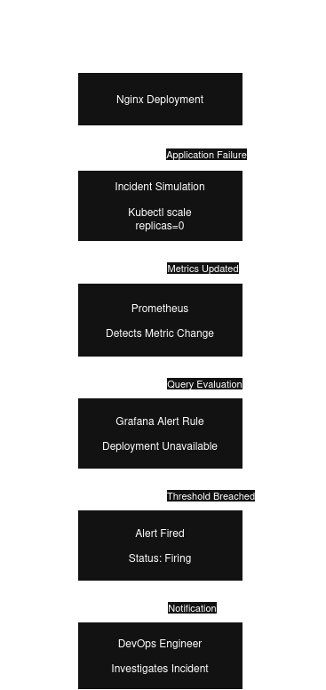

# 🚀 Kubernetes Observability Platform

Projeto de observabilidade Kubernetes desenvolvido com Prometheus, Grafana e Alertmanager em ambiente local utilizando Minikube.

O objetivo é demonstrar competências práticas em Monitoramento, Observabilidade, Alertas, Resposta a Incidentes, Troubleshooting e Administração de Kubernetes.

---

# 📌 Visão Geral

Esta plataforma de observabilidade foi desenvolvida para monitorar workloads Kubernetes utilizando Prometheus, Grafana e Alertmanager em um ambiente local baseado em Minikube.

O projeto demonstra a implementação de um pipeline completo de observabilidade, incluindo:

* Coleta de métricas de infraestrutura e aplicações
* Criação de dashboards customizados
* Configuração de alertas
* Simulação de incidentes
* Resposta a incidentes
* Notificações por e-mail
* Documentação arquitetural
* Troubleshooting em Kubernetes

Durante o desenvolvimento foram criados dashboards específicos para CPU, memória, disponibilidade e visão geral do cluster, além da validação de um fluxo real de detecção e tratamento de incidentes.

---

# 🏗️ Arquitetura


## Componentes

* Kubernetes (Minikube)
* Prometheus
* Grafana
* Alertmanager
* Node Exporter
* kube-state-metrics
* Nginx Deployment

## Fluxo de Monitoramento

Nginx Deployment → Kubernetes Metrics → Prometheus → Grafana Dashboards → Alertmanager → Email Notification

---

# 🚨 Fluxo de Resposta a Incidentes



Fluxo validado durante a simulação de incidente:

Nginx Deployment → Incident Simulation → Prometheus → Grafana Alert Rule → Alert Fired → DevOps Engineer

---

# ⚙️ Tecnologias Utilizadas

* Kubernetes
* Minikube
* Docker
* Prometheus
* Grafana
* Alertmanager
* Node Exporter
* kube-state-metrics
* Git
* GitHub
* Linux
* YAML

---

# 📂 Estrutura do Projeto

```text
k8s-observability-platform
├── app/
├── dashboards/
├── docs/
│   ├── architecture/
│   ├── incidents/
│   └── screenshots/
├── k8s/
├── monitoring/
└── README.md
```

---

# 📊 Dashboards

O projeto possui dashboards customizados desenvolvidos no Grafana.

## Cluster Overview

* CPU Usage %
* Memory Usage %
* Running Pods
* Available Replicas


---

## Cluster CPU

* CPU Usage %
* CPU Idle %
* CPU Busy %


---

## Cluster Memory

* Memory Usage %
* Total Memory (GB)
* Available Memory (GB)
* Used Memory (GB)


---

## Cluster Availability

* Running Pods
* Failed Pods
* Pending Pods
* Available Replicas
* Desired Replicas


---

# 📈 Métricas Monitoradas

## CPU Usage

```promql
100 - (avg(rate(node_cpu_seconds_total{mode="idle"}[5m])) * 100)
```

## Memory Usage

```promql
(1 - (node_memory_MemAvailable_bytes / node_memory_MemTotal_bytes)) * 100
```

## Running Pods

```promql
count(kube_pod_status_phase{phase="Running"})
```

## Available Replicas

```promql
sum(kube_deployment_status_replicas_available)
```

---

# 🔔 Alertas

## Deployment Unavailable

Monitoramento:

```promql
kube_deployment_status_replicas_available
```

Condição:

```text
Available Replicas < 1
```

Objetivo:

Detectar indisponibilidade de workloads Kubernetes.

---

# 📧 Notificações por E-mail

Os alertas podem ser encaminhados por e-mail utilizando Alertmanager.

Evidência de notificação recebida:


---

# 🧪 Simulação de Incidente

Para validar o pipeline de observabilidade foi realizada uma simulação controlada de falha.

## Cenário

Escalonamento do deployment para zero réplicas:

```bash
kubectl scale deployment nginx-deployment \
--replicas=0 \
-n development
```

## Resultado Obtido

* Aplicação indisponível
* Métricas atualizadas
* Prometheus detectou alteração
* Grafana avaliou a regra
* Alerta disparado
* Processo de investigação iniciado

Documentação completa:

```text
docs/incidents/nginx-deployment-unavailable.md
```

---

# 📸 Evidências

## Prometheus Targets


## Prometheus Query


## Prometheus Alerts


## Kubernetes Pods


## Kubernetes Services


---

# 📦 Dashboards Exportados

Os dashboards estão disponíveis para importação na pasta:

```text
dashboards/
```

Arquivos:

* cluster-overview.json
* cluster-availability.json
* cluster-cpu.json
* cluster-memory.json

---

# 🛠️ Deploy

Aplicar manifests:

```bash
kubectl apply -k k8s/overlays/dev
```

---

# 📚 Habilidades Demonstradas

* Kubernetes
* Observabilidade
* Monitoramento
* Prometheus
* Grafana
* Alertmanager
* Linux
* YAML
* DevOps
* SRE Fundamentals
* Incident Response
* Troubleshooting
* Dashboard Creation
* Alerting
* Infrastructure Monitoring

---

# 🎯 Objetivo Profissional

Este projeto foi desenvolvido como laboratório prático para consolidação de conhecimentos em DevOps, Observabilidade e Kubernetes, simulando cenários comuns encontrados em ambientes de produção.

---

# 👨‍💻 Autor

Daniel Viana